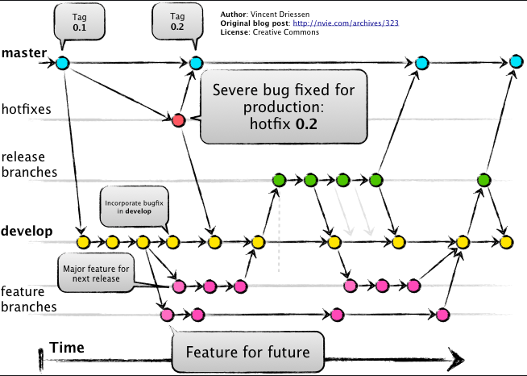

# Folder Naming Rules

- @\*\* : Required/Global Modules
- util : No Module

# Milestones

- 제일 큰 프로젝트
- 무조건 해당 `Milestone` 에 밀접한 `Issue`들만 작성할 것
- 공통된 하나의 `Milestone`을 가진 `Issue` 들은 서로 다른 `Project`들을 가질 수 있다.
  - 하나의 `Milestone`가 여러 개의 `Project`들을 가질 수 있다.

# Branch Rules

- master
- release
- develop
- feat/<ISSUE_NUMBER>
- fix/<ISSUE_NUMBER>
- test/<ISSUE_NUMBER>
- chore/<ISSUE_NUMBER>

# Commit Rules

- [Semantic Commit Messages](https://gist.github.com/joshbuchea/6f47e86d2510bce28f8e7f42ae84c716)
- feat(ISSUE_NUMBER): (new feature for the user, not a new feature for build script)
- fix(ISSUE_NUMBER): (bug fix for the user, not a fix to a build script)
- docs(ISSUE_NUMBER): (changes to the documentation)
- style(ISSUE_NUMBER): (formatting, missing semi colons, etc; no production code change)
  - 포맷팅, eslint fix 등등
- refactor(ISSUE_NUMBER): (refactoring production code, eg. renaming a variable)
  - 코드 리팩토링
- test(ISSUE_NUMBER): (adding missing tests, refactoring tests; no production code change)
  - 테스트 코드 작성
- chore(ISSUE_NUMBER): (updating grunt tasks etc; no production code change)
  - 코드변경없음, 빌드업무수정, 패키지 매니저 수정, 환경설정
